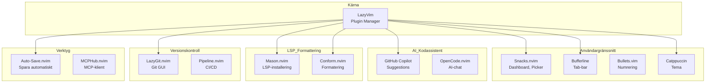
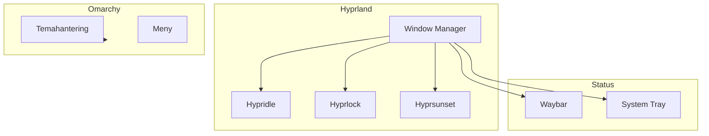
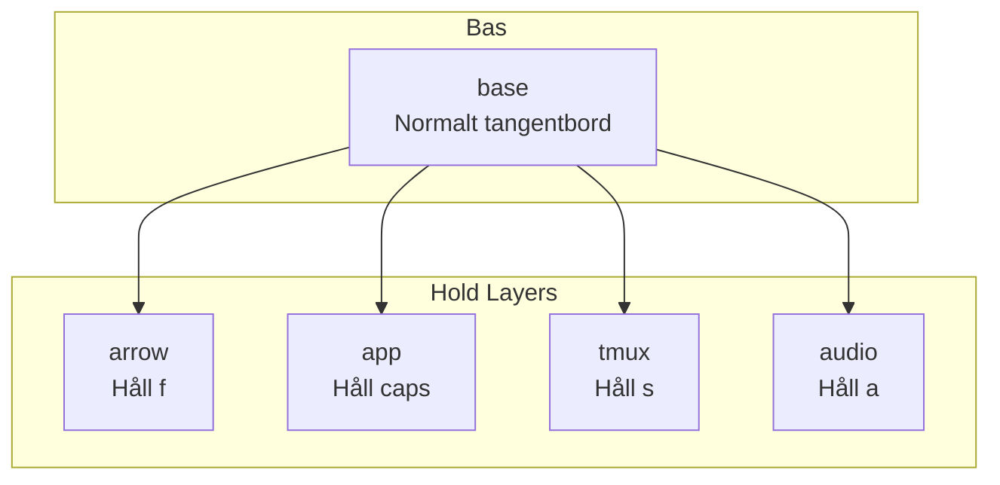
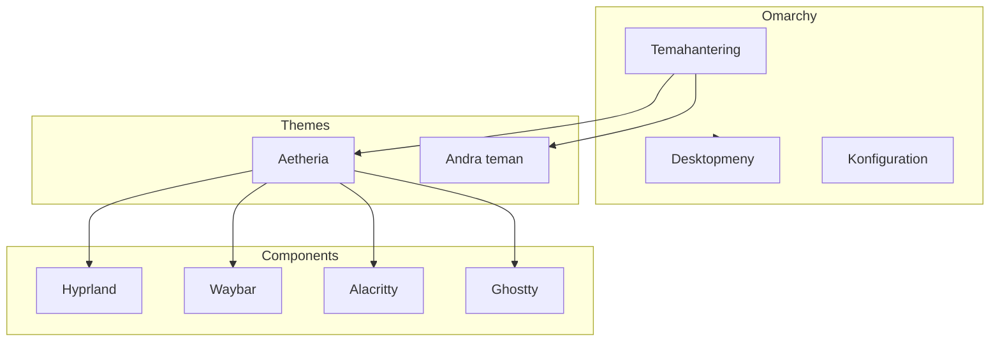

<p align="center">
  <a href="https://simonbrundin.com">
    <picture>
      <source media="(prefers-color-scheme: dark)" srcset="https://alfonsofortunato.com/img/logo.png">
      
    </picture>
    <h1 align="center">Dotfiles MacOS and Linux</h1>
  </a>
</p>

<p align="center">
  <a href="https://github.com/simonbrundin/dotfiles/commit">
    
  </a>
  <a href="https://github.com/simonbrundin/dotfiles/blob/main/LICENSE">
    
  </a>
</p>

# Dotfiles

Alla dotfiles hanteras med **GNU Stow**.

## Setup

### Automatisk installation

```
curl -sL bootstrap.simonbrundin.com | bash
```

### Manuell installation

1. Klona repot:

   ```
   git clone git@github.com:simonbrundin/dotfiles.git ~/repos/dotfiles
   ```

2. Installera paket (valfritt):

   ```
   brew bundle --file=~/repos/dotfiles/brew/.Brewfile
   ```

3. Skapa symlinks med stow:

   ```
   cd ~/repos/dotfiles
   stow alacritty bash brew hypr kanata neovim nushell opencode omarchy sidecar starship stow tmux tmuxinator voxtype
   ```

## Struktur

Varje applikation har sin konfiguration i en egen katalog:

- `hypr/` → `~/.config/hypr/`
- `neovim/` → `~/.config/nvim/`
- `tmux/` → `~/.config/tmux/` och `~/.tmux.conf`
- etc.

---

## Neovim

Min Neovim-konfiguration använder **LazyVim** som bas och är organiserad med följande struktur:

```
neovim/.config/nvim/
├── lua/
│   ├── config/          # Grundläggande konfiguration
│   │   ├── autocmds.lua
│   │   ├── keymaps.lua
│   │   ├── lazy.lua
│   │   └── options.lua
│   ├── plugins/         # Plugin-specifikationer
│   │   ├── avante.lua
│   │   ├── bufferline.lua
│   │   ├── catppuccin.lua
│   │   ├── conform.lua
│   │   ├── copilot.lua
│   │   ├── lazygit.lua
│   │   ├── snacks.lua
│   │   └── ...
│   └── disabled-plugins/ # Temporärt avaktiverade plugins
└── plugin/              # Egna plugin-script
```

### Arkitektur



### Installerade Plugins

#### 🍭 Snacks.nvim

**Swiss Army Knife för Neovim** - En samling av användbara funktioner.

Används för:

- **Dashboard** - Välkomstskärm vid start
- **Explorer** - Filbläddring med `<leader>e`
- **Picker** - Snabb fil/sök-hitta med `<leader><space>`
- **Notifier** - Visuella notifieringar
- **Terminal** - Inbyggd terminal med `<C-/>`
- **Git Status** - `<leader>gs` för git-ändringar
- **Zen Mode** - Fokusläge med `<leader>z`

#### 🔧 Mason.nvim

Installerar och hanterar LSP-servrar, formaterare och diagnostikverktyg.

```lua
-- Installerade servrar:
gopls  -- Go language server
```

#### ✨ Conform.nvim

Automatisk kodformatering vid spara (`BufLeave`, `FocusLost`).

**Aktiverade formaterare:**

| Filtyp | Formaterare |
|--------|-------------|
| markdown | prettier |
| yaml | prettier |
| typescript | prettier |
| templ | templ |

#### 🤖 GitHub Copilot

Inline kodförslag med AI.

| Tangent | Åtgärd |
|---------|--------|
| `<M-l>` | Acceptera förslag |
| `<M-]>` | Nästa förslag |
| `<M-[>` | Föregående förslag |
| `<C-]>` | Avböj förslag |

**Inaktiverad för:** `yaml`, `markdown`, `help`

#### 💬 OpenCode.nvim

AI-chatintegration direkt i Neovim.

| Kommando | Beskrivning |
|----------|-------------|
| `<leader>ot` | Slå på/stäng av OpenCode |
| `<leader>oa` | Ställ en fråga |
| `<leader>op` | Välj prompt |
| `<S-C-u/d>` | Scrolla i chatten |

#### 📄 Bufferline

Visar öppna buffertar somflikflikar i toppen av fönstret.

#### 📝 Bullets.vim

Automatisk numrering av listor i markdown och textfiler.

```markdown
1. Första punkten
2. Andra punkten
   - Underpunkt
   - Underpunkt
3. Tredje punkten
```

#### 💾 Auto-Save.nvim

Sparar filer automatiskt när du byter fönster eller buffert.

**Trigger-händelser:**

- `BufLeave` - När du lämnar en buffert
- `FocusLost` - När Neovim tappar fokus
- `TextChanged` - När text ändras (med debounce)
- `QuitPre` - Vid avslutning

**Inaktiverad för:**

- Insert-läge (förhindrar spara under textredigering)
- `harpoon` och `mysql` filtyper

#### 🐙 LazyGit.nvim

Inbyggd Git-GUI med `<leader>gg`.

#### 🔄 Pipeline.nvim

CI/CD-pipelinehantering direkt i Neovim.

| Kommando | Beskrivning |
|----------|-------------|
| `<leader>ci` | Öppna Pipeline |

#### 🎨 Catppuccin

Ett av flera installerade teman (se nedan).

#### 🛠️ MCPHub.nvim

Klient för Model Context Protocol - möjliggör integration med externa AI-tjänster.

#### 🔐 Remote-SSHFS.nvim

Redigera filer på fjärrservrar via SSHFS.

#### Tilt LSP

Stöd för Tilt-filer (`Tiltfile`) med dedikerad LSP-konfiguration.

### Teman

Följande teman är installerade och kan växlas mellan:

| Tema | Beskrivning |
|------|-------------|
| Catppuccin | Mjuk, pastellig palette |
| Nord | Iskall nordisk design |
| Tokyo Night | Mörk, avslappnande |
| Rose Pine | Varm, naturlig |
| Gruvbox | Retro, tight kontrast |
| Kanagawa | Japansk estetik |
| Everforest | Skogsgrön |
| Flexoki | Läsbar, diskret |
| Monokai Pro | Klassisk färgpalett |
| Matte Black | Ultra-mörk |
| Bamboo | Naturligt, varmt |

**Växla tema:** `<leader>uC`

### Viktiga Tangentbordsgenvägar

#### Grundläggande navigation

| Genväg | Funktion |
|--------|----------|
| `<leader><space>` | Smart filsökning |
| `<leader>e` | Filutforskare |
| `<leader>j` | Buffer-lista |
| `<leader>/` | Sök i filer |
| `gd` | Gå till definition |
| `gr` | Hitta referenser |

#### Toggla-alternativ

| Genväg | Funktion |
|--------|----------|
| `<leader>us` | Stavningskontroll |
| `<leader>uw` | Word wrap |
| `<leader>ud` | Diagnostik |
| `<leader>ul` | Radnummer |
| `<leader>uT` | Treesitter |
| `<leader>ub` | Ljust/mörkt tema |

#### Terminal

| Genväg | Funktion |
|--------|----------|
| `<C-/>` | Öppna terminal |
| `<leader>gg` | LazyGit |
| `<leader>n` | Notifieringar |

### Konfigurationsfiler

- `lua/config/options.lua` - Grundläggande Neovim-alternativ
- `lua/config/keymaps.lua` - Anpassade tangentbindningar
- `lua/config/autocmds.lua` - Anpassade autocommands
- `lua/plugins/` - Plugin-konfiguration (en fil per plugin)

---

## Hyprland

**Wayland-fönsterhanterare** med dynamisk tiling och flytande fönster. Konfigurationen integreras med **Omarchy** för temahantering.

### Mappstruktur

```
hypr/.config/hypr/
├── hyprland.conf      # Huvudkonfiguration
├── bindings.conf      # Tangentbindningar
├── autostart.conf     # Program som startar automatiskt
├── monitors.conf      # Skärmkonfiguration
├── input.conf         # Inmatningsinställningar
├── looknfeel.conf     # Utseende & känsla
├── workspace-rules.conf
├── hypridle.conf      # Skärmlås
├── hyprlock.conf      # Skärmlåsskärm
├── hyprsunset.conf    # Blåljusfilter
└── envs.conf         # Miljövariabler
```

### Tangentbindningar

Hyprland använder Omarchys standardbindningar, utökade med personliga tillägg:

| Genväg | Åtgärd |
|--------|--------|
| `Super + Return` | Öppna terminal |
| `Super + Shift + Return` | Tmux-terminal |
| `Super + Shift + F` | Filhanterare (Nautilus) |
| `Super + Shift + B` | Webbläsare |
| `Super + Shift + N` | Neovim (Editor) |
| `Super + Shift + D` | Docker TUI |
| `Super + Shift + G` | Signal |
| `Super + Shift + M` | Spotify |
| `Super + Shift + W` | Typora |

#### Web-appar

| Genväg | Mål |
|--------|-----|
| `Super + Shift + A` | ChatGPT |
| `Super + Shift + Y` | YouTube |
| `Super + Shift + E` | Email (Hey) |
| `Super + Shift + C` | Kalender |
| `Super + Shift + X` | X/Twitter |
| `Super + Shift + P` | Google Photos |

### Workspace-regler

Varje applikation har tilldelade workspaces:

| Workspace | Applikation |
|-----------|-------------|
| 1 | Terminal/Tmux |
| 2 | Webbläsare |
| 3 | AI-verktyg |
| 4 | Anteckningar |
| 5 | Konfiguration |
| 6 | Mooni |
| 10 | UniFi Controller |

### Systemintegration



---

## Waybar

**Snabb och stilren statusrad** för Hyprland. Visar systeminformation, workspaces och anpassade moduler.

### Konfigurerade moduler

#### Vänster sida

| Modul | Beskrivning |
|-------|-------------|
| `omarchy` | Omarchy-menyikon |
| `workspaces` | Workspace-indikator (1-10) |

#### Centrum

| Modul | Beskrivning |
|-------|-------------|
| `update` | Uppdateringsindikator |
| `screenrecording` | Skärminspelningsindikator |
| `task` | Aktiva uppgifter |

#### Höger sida

| Modul | Beskrivning |
|-------|-------------|
| `tray` | Systemfack |
| `bluetooth` | Bluetooth-status |
| `network` | Nätverksstatus |
| `pulseaudio` | Ljudvolym |
| `cpu` | CPU-användning |
| `battery` | Batteristatus |
| `clock` | Klocka |

### Anpassade skript

| Skript | Funktion |
|--------|----------|
| `task_script.sh` | Visa aktiva Fusion-uppgifter |
| `screen-recording.sh` | Indikator för skärminspelning |
| `idle.sh` | Inaktivitetsindikator |
| `notification-silencing.sh` | Tystnadsläge |

### Workspace-visning

```
┌─────────────────────────────────────────────────────────┐
│ [Omarchy] [1] [2] [3] [4] [5]   [Update] [Task]   🔊 📶 🔋 14:32  │
└─────────────────────────────────────────────────────────┘
```

---

## Tmux

**Terminal-multiplexer** med sessioner, fönster och paneler. Används för att organisera arbetsflöden.

### Konfiguration

```bash
Prefix: Ctrl-b
```

### Plugins

| Plugin | Funktion |
|--------|----------|
| **Catppuccin** | Tema (Mocha) |
| **tpm** | Plugin Manager |
| **tmux-battery** | Batteristatus |
| **tmux-cpu** | CPU-användning |
| **tmux-continuum** | Sessionssparning |
| **sesh** | Zoxide-integrerad sessionhantering |
| **gitmux** | Git-status i statusrad |

### Tangentbindningar

| Genväg | Funktion |
|--------|----------|
| `Ctrl-b r` | Ladda om konfiguration |
| `Ctrl-b x` | Stäng pane |
| `Ctrl-b f` | Öppna Files-session |
| `Ctrl-b h/j/k/l` | Navigera paneler |
| `Ctrl-u` | Sesh sessionväljare (med fzf) |
| `Ctrl-y` | Nästa fönster |

### Sesh Sessionväljare

`Ctrl-u` öppnar en interaktiv sessionväljare med:

```
┌──────────────────────────────────────────────────────────┐
│  ⚡  session                                                │
│  ─────────────────────────────────────────────────────────│
│  🪟 tmux sessions                                          │
│  ⚙️  configs                                                │
│  📁 zoxide dirs                                            │
│                                                          │
│  ┌────────────────────────────────────────────────────┐   │
│  │ ● Dotfiles                                         │   │
│  │ ● Kubernetes                                       │   │
│  │ ● Home                                            │   │
│  │ ● Plan                                            │   │
│  │ ● Agents                                          │   │
│  └────────────────────────────────────────────────────┘   │
│                                                          │
│  ^a all  ^t tmux  ^g configs  ^x zoxide  ^d kill  ^f find │
└──────────────────────────────────────────────────────────┘
```

### Tmuxinator

**Fördefinierade sessioner** för olika arbetsflöden:

```yaml
# Exempel: Kubernetes.yml
name: kubernetes
root: ~/repos/infrastructure
windows:
  - editor:
      layout: main-vertically
      panes:
        - nvim
        - kubectl get pods -n flux-system
  - monitoring: lazydocker
  - shell: ~
```

| Session | Syfte |
|---------|--------|
| `Dotfiles` | Dotfiles-arbete |
| `Kubernetes` | Klusterhantering |
| `Plan` | Planering och anteckningar |
| `Agents` | AI-agentövervakning |
| `Infrastructure` | Kubernetes-konfiguration |
| `Hacking` | Utforskande arbete |
| `Music` | Musikstreamingtjänster |

---

## Kanata

**Tangentbordsanpassning** med avancerade layouter och alias. Förbättrar produktivitet genom smarta tangentkombinationer.

### Mappstruktur

```
kanata/.config/kanata/
├── kanata.kbd          # Huvudkonfiguration
├── kanata-wrapper.sh   # Startskript
├── kanata.service      # Systemd-tjänst
├── switch-session.sh   # Sessionsbyte
├── spotify-ctl.sh      # Spotify-kontroll
└── etc/
    ├── systemd/system/  # Systemd-filer
    └── udev/rules/     # Enhetsregler
```

### Lagersystem



### Tap-Hold Beteende

| Tangent | Tap | Hold |
|---------|-----|------|
| `Caps` | `Esc` | `Meta` |
| `f` | `f` | Arrow-lager |
| `s` | `s` | Tmux-lager |
| `a` | `a` | Audio-lager |
| `meh` | `Esc` | Plan-växling |

### App-lager (Caps + Hold)

Snabbåtkomst till applikationer:

| Tangent | Applikation |
|---------|-------------|
| `unifi` | UniFi Controller |
| `term` | Terminal |
| `web` | Webbläsare |
| `ai` | AI-workspace |
| `note` | Anteckningar |
| `mooni` | Mooni |
| `grok` | Grok |

### Tmux-lager

| Tangent | Åtgärd |
|---------|--------|
| `C-b $` | Byt session |
| `C-b s` | Lista sessioner |
| `C-b p` | Föregående |
| `C-b n` | Nästa |
| `C-b c` | Skapa |
| `C-b x` | Stäng |
| `C-b ,` | Byt namn |

---

## Starship

**Minimalistisk och snabb prompt** med rik information om git, program och mer.

### Format

```
[OS][User][📁 Current Dir][🌿 Git Branch][⚡ Git Status] [🕐 Time]
❯
```

### Aktiverade moduler

| Modul | Symbol | Visar |
|-------|--------|-------|
| `os` | 🌐 | Operativsystem |
| `username` | 👤 | Användarnamn |
| `directory` | 📁 | Aktuell mapp (trunkerad) |
| `git_branch` | 🌿 | Git-branch |
| `git_status` | ⚡ | Ändringar, commits |
| `nodejs` | 🜘 | Node.js-version |
| `c` |  | C-version |
| `rust` |  | Rust-version |
| `golang` |  | Go-version |
| `python` |  | Python-version |
| `docker_context` | 🐳 | Docker-kontext |
| `time` | 🕐 | Tid |

### Färgschema

Använder **Catppuccin Mocha** som palette:

```toml
palette = 'catppuccin_mocha'

[palettes.catppuccin_mocha]
peach = "#fab387"    # Directory
green = "#a6e3a1"    # Git branch
teal = "#94e2d5"     # Programversioner
blue = "#89b4fa"     # Docker
purple = "#cba6f7"   # Tid
```

### Mapp-substitutioner

| Kortkommando | Fullständig sökväg |
|--------------|--------------------|
| 📁 `…/` | Aktuell mapp (3 nivåer) |
| 📁 `…/` | Documents → `󰈙` |
| 📁 `…/` | Downloads → `` |
| 📁 `…/` | Music → `󰝚` |
| 📁 `…/` | Pictures → `` |
| 📁 `…/` | Developer → `󰲋` |

---

## Terminaler

### Alacritty

**GPU-accelererad terminalemulator** med minimal latens.

```toml
[font]
family = "JetBrainsMono Nerd Font"
size = 9

[window]
padding.x = 14
padding.y = 14
decorations = "None"

[terminal.shell]
program = "/home/linuxbrew/.linuxbrew/bin/nu"
```

| Inställning | Värde |
|-------------|-------|
| Font | JetBrainsMono Nerd Font 9pt |
| Padding | 14px |
| Dekorationer | None (ramlös) |
| Shell | Nushell |

### Ghostty

**Snabb terminalemulator** byggd medansamtidighet i åtanke.

```
font-family = "JetBrainsMono Nerd Font"
font-size = 9
window-padding-x = 14
window-padding-y = 14
cursor-style = "block"
async-backend = epoll
```

| Inställning | Värde |
|-------------|-------|
| Font | JetBrainsMono 9pt |
| Padding | 14px |
| Cursor | Block (fast) |
| Backend | epoll (Linux) |
| Shell-integration | SSH + cursor |

---

## Nushell

**Modern, strukturerad shell** med inbyggt dataformatering och VI-stöd.

### Konfiguration

```nu
# ~/.config/nushell/config.nu

$env.config = {
    show_banner: false
    edit_mode: "vi"
    cursor_shape: {
        vi_insert: "line"
        vi_normal: "block"
    }
    buffer_editor: "nvim"
}
```

### Alias

| Alias | Kommando | Beskrivning |
|-------|----------|-------------|
| `n` | nvim | Textredigerare |
| `lg` | lazygit | Git GUI |
| `y` | yazi | Filhanterare |
| `d` | dagger | CI/CD |
| `ld` | lazydocker | Docker GUI |
| `ai` | simon ai | AI-klient |
| `s` | simon | Personligt CLI |
| `k` | kubectl | Kubernetes |
| `t` | talosctl | Talos |

### Miljövariabler

```nu
$env.devenv-repo = "/home/simon/repos/devenv"
$env.dotfiles-path = "$HOME/repos/dotfiles"
$env.OMARCHY_PATH = "$HOME/.local/share/omarchy"
```

### PATH-sökvägar

Prioriterade sökvägar:

```nu
/home/simon/repos/simon-cli
/home/linuxbrew/.linuxbrew/bin
/home/simon/go/bin
/home/simon/.cargo/bin
~/.local/bin
```

---

## Tmuxinator

**Sessionshantering** för återkommande arbetsflöden. Skapar kompletta workspaces med flera fönster och paneler.

### Tilgängliga Sessioner

| Session | Beskrivning |
|---------|-------------|
| `AI` | AI-experiment och debugging |
| `Agents` | Agentövervakning |
| `Begbot` | Discord-bot |
| `Boot Dev` | Boot-utveckling |
| `Cluster Agent` | Klusterhantering |
| `Deployment Pipeline` | CI/CD-arbete |
| `Dotfiles` | Dotfiles-arbete |
| `Files` | Filhantering |
| `Hacking` | Utforskande arbete |
| `Home` | Hemautomatisering |
| `Homelab` | Homelab-konfiguration |
| `Infrastructure` | Kubernetes + Talos |
| `Kubernetes` | Klusterövervakning |
| `MatchMaker` | Matchningstjänst |
| `Mooni` | AI-companion |
| `Music` | Musikstreaming |
| `Network` | Nätverkskonfiguration |
| `Nuxt Base Layer` | Nuxt-projekt |
| `Plan` | Planering |
| `Repository Template` | Projektmallar |
| `Simon CLI` | CLI-utveckling |
| `Support - Pappa` | Support-session |
| `Terminal` | Allmän terminal |

### Exempel: Infrastructure

```yaml
name: infrastructure
root: ~/repos/infrastructure
windows:
  - editor:
      layout: main-vertically
      panes:
        - nvim
        - kubectl get pods -A
  - monitoring: btop
  - terraform: ~
  - logs: tail -f /var/log/syslog
```

---

## Omarchy

**Desktop Environment Framework** som hanterar tema, konfiguration och integration mellan komponenter.

### Integration



### Funktioner

| Funktion | Beskrivning |
|----------|-------------|
| **Teman** | Centraliserad temahantering |
| **Meny** | Super + Alt + Space |
| **Launchers** | Applikationsstartare |
| **Toggles** | Dynamiska konfigurationsflaggor |
| **Waybar-integration** | Statusbarsmoduler |

---

## Övriga Konfigurationer

### Bash

- `bash/profile` - Systemomfattande inställningar
- `bash/bashrc` - Interaktiva inställningar
- `bash/zshrc` - Zsh-kompatibilitet

### Brew

- `brew/.Brewfile` - Homebrew-paket för macOS och Linux

### NetworkManager

- `networkmanager/` - Nätverkskonfiguration

### Sidecar

- `sidecar/` - iPad-sidecar-inställningar

### Walker

- `walker/.config/walker/config.toml` - Snabbappmeny

### Voxtype

- `voxtype/.config/voxtype/config.toml` - Tal-till-text-klient

### Elio

- `elio/.config/elio/` - Terminal AI-klient

### Stow

- `stow/` - GNU Stow-konfiguration
