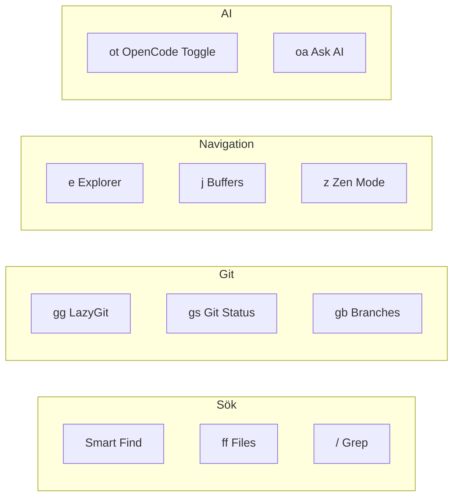

<p align="center">
  <a href="https://simonbrundin.com">
    <picture>
      <source media="(prefers-color-scheme: dark)" srcset="https://alfonsofortunato.com/img/logo.png">
      
    </picture>
    <h1 align="center">Dotfiles MacOS and Linux</h1>
  </a>
</p>

<p align="center">
  <a href="https://github.com/simonbrundin/dotfiles/commit">
    
  </a>
  <a href="https://github.com/simonbrundin/dotfiles/blob/main/LICENSE">
    
  </a>
</p>

# Dotfiles

Alla dotfiles hanteras med **GNU Stow**.

## Setup

### Automatisk installation

```
curl -sL bootstrap.simonbrundin.com | bash
```

### Manuell installation

1. Klona repot:

   ```
   git clone git@github.com:simonbrundin/dotfiles.git ~/repos/dotfiles
   ```

2. Installera paket (valfritt):

   ```
   brew bundle --file=~/repos/dotfiles/brew/.Brewfile
   ```

3. Skapa symlinks med stow:

   ```
   cd ~/repos/dotfiles
   stow alacritty bash brew hypr kanata neovim nushell opencode omarchy sidecar starship stow tmux tmuxinator voxtype
   ```

## Struktur

Varje applikation har sin konfiguration i en egen katalog:

- `hypr/` → `~/.config/hypr/`
- `neovim/` → `~/.config/nvim/`
- `tmux/` → `~/.config/tmux/` och `~/.tmux.conf`
- etc.

---

## Neovim

Min Neovim-konfiguration använder **LazyVim** som bas och är organiserad med följande struktur:

```
neovim/.config/nvim/
├── lua/
│   ├── config/          # Grundläggande konfiguration
│   │   ├── autocmds.lua
│   │   ├── keymaps.lua
│   │   ├── lazy.lua
│   │   └── options.lua
│   ├── plugins/         # Plugin-specifikationer
│   │   ├── avante.lua
│   │   ├── bufferline.lua
│   │   ├── catppuccin.lua
│   │   ├── conform.lua
│   │   ├── copilot.lua
│   │   ├── lazygit.lua
│   │   ├── snacks.lua
│   │   └── ...
│   └── disabled-plugins/ # Temporärt avaktiverade plugins
└── plugin/              # Egna plugin-script
```

### Arkitektur

```mermaid
flowchart TB
    subgraph Kärna
        LazyVim["LazyVim<br/>(Plugin Manager)"]
    end

    subgraph Användargränssnitt
        Snacks["🍭 Snacks.nvim<br/>(Dashboard, Picker, Explorer)"]
        Bufferline["Bufferline<br/>(Tab-bar)"]
        Bullets["Bullets.vim<br/>(Automatisk numrering)"]
        Catppuccin["Catppuccin<br/>(Tema)"]
    end

    subgraph AI & Kodassistent
        Copilot["GitHub Copilot<br/>(Code Suggestions)"]
        OpenCode["OpenCode.nvim<br/>(AI-chat)"]
    end

    subgraph LSP & Formattering
        Mason["Mason.nvim<br/>(LSP-installering)"]
        Conform["Conform.nvim<br/>(Formatering)"]
        Prettier["Vim-Prettier<br/>(Markdown)"]
    end

    subgraph Versionskontroll
        LazyGit["LazyGit.nvim<br/>(Git GUI)"]
        Pipeline["Pipeline.nvim<br/>(CI/CD)"]
        GitHubActions["Pipeline.nvim<br/>(Actions)"]
    end

    subgraph Verktyg
        AutoSave["Auto-Save.nvim<br/>(Spara automatiskt)"]
        MCPHub["MCPHub.nvim<br/>(MCP-klient)"]
        SSHF["Remote-SSHFS.nvim<br/>(Fjärrfiler)"]
    end

    LazyVim --> Snacks
    LazyVim --> Bufferline
    LazyVim --> Catppuccin
    LazyVim --> Copilot
    LazyVim --> Mason
    LazyVim --> Conform
    LazyVim --> LazyGit
    LazyVim --> AutoSave
```



### Installerade Plugins

#### 🍭 Snacks.nvim

**Swiss Army Knife för Neovim** - En samling av användbara funktioner.

Används för:

- **Dashboard** - Välkomstskärm vid start
- **Explorer** - Filbläddring med `<leader>e`
- **Picker** - Snabb fil/sök-hitta med `<leader><space>`
- **Notifier** - Visuella notifieringar
- **Terminal** - Inbyggd terminal med `<C-/>`
- **Git Status** - `<leader>gs` för git-ändringar
- **Zen Mode** - Fokusläge med `<leader>z`

#### 🔧 Mason.nvim

Installerar och hanterar LSP-servrar, formaterare och diagnostikverktyg.

```lua
-- Installerade servrar:
gopls  -- Go language server
```

#### ✨ Conform.nvim

Automatisk kodformatering vid spara (`BufLeave`, `FocusLost`).

**Aktiverade formaterare:**

| Filtyp | Formaterare |
|--------|-------------|
| markdown | prettier |
| yaml | prettier |
| typescript | prettier |
| templ | templ |

#### 🤖 GitHub Copilot

Inline kodförslag med AI.

| Tangent | Åtgärd |
|---------|--------|
| `<M-l>` | Acceptera förslag |
| `<M-]>` | Nästa förslag |
| `<M-[>` | Föregående förslag |
| `<C-]>` | Avböj förslag |

**Inaktiverad för:** `yaml`, `markdown`, `help`

#### 💬 OpenCode.nvim

AI-chatintegration direkt i Neovim.

| Kommando | Beskrivning |
|----------|-------------|
| `<leader>ot` | Slå på/stäng av OpenCode |
| `<leader>oa` | Ställ en fråga |
| `<leader>op` | Välj prompt |
| `<S-C-u/d>` | Scrolla i chatten |

#### 📄 Bufferline

Visar öppna buffertar som flikflikar i toppen av fönstret.

#### 📝 Bullets.vim

Automatisk numrering av listor i markdown och textfiler.

```markdown
1. Första punkten
2. Andra punkten
   - Underpunkt
   - Underpunkt
3. Tredje punkten
```

#### 💾 Auto-Save.nvim

Sparar filer automatiskt när du byter fönster eller buffert.

**Trigger-händelser:**

- `BufLeave` - När du lämnar en buffert
- `FocusLost` - När Neovim tappar fokus
- `TextChanged` - När text ändras (med debounce)
- `QuitPre` - Vid avslutning

**Inaktiverad för:**

- Insert-läge (förhindrar spara under textredigering)
- `harpoon` och `mysql` filtyper

#### 🐙 LazyGit.nvim

Inbyggd Git-GUI med `<leader>gg`.

#### 🔄 Pipeline.nvim

CI/CD-pipelinehantering direkt i Neovim.

| Kommando | Beskrivning |
|----------|-------------|
| `<leader>ci` | Öppna Pipeline |

#### 🎨 Catppuccin

Ett av flera installerade teman (se nedan).

#### 🛠️ MCPHub.nvim

Klient för Model Context Protocol - möjliggör integration med externa AI-tjänster.

#### 🔐 Remote-SSHFS.nvim

Redigera filer på fjärrservrar via SSHFS.

#### Tilt LSP

Stöd för Tilt-filer (`Tiltfile`) med dedikerad LSP-konfiguration.

### Teman

Följande teman är installerade och kan växlas mellan:

| Tema | Beskrivning |
|------|-------------|
| Catppuccin | Mjuk, pastellig palette |
| Nord | Iskall nordisk design |
| Tokyo Night | Mörk, avslappnande |
| Rose Pine | Varm, naturlig |
| Gruvbox | Retro, tight kontrast |
| Kanagawa | Japansk estetik |
| Everforest | Skogsgrön |
| Flexoki | Läsbar, diskret |
| Monokai Pro | Klassisk färgpalett |
| Matte Black | Ultra-mörk |
| Bamboo | Naturligt, varmt |

**Växla tema:** `<leader>uC`

### Viktiga Tangentbordsgenvägar



#### Grundläggande navigation

| Genväg | Funktion |
|--------|----------|
| `<leader><space>` | Smart filsökning |
| `<leader>e` | Filutforskare |
| `<leader>j` | Buffer-lista |
| `<leader>/` | Sök i filer |
| `gd` | Gå till definition |
| `gr` | Hitta referenser |

#### Toggla-alternativ

| Genväg | Funktion |
|--------|----------|
| `<leader>us` | Stavningskontroll |
| `<leader>uw` | Word wrap |
| `<leader>ud` | Diagnostik |
| `<leader>ul` | Radnummer |
| `<leader>uT` | Treesitter |
| `<leader>ub` | Ljust/mörkt tema |

#### Terminal

| Genväg | Funktion |
|--------|----------|
| `<C-/>` | Öppna terminal |
| `<leader>gg` | LazyGit |
| `<leader>n` | Notifieringar |

### Konfigurationsfiler

- `lua/config/options.lua` - Grundläggande Neovim-alternativ
- `lua/config/keymaps.lua` - Anpassade tangentbindningar
- `lua/config/autocmds.lua` - Anpassade autocommands
- `lua/plugins/` - Plugin-konfiguration (en fil per plugin)
