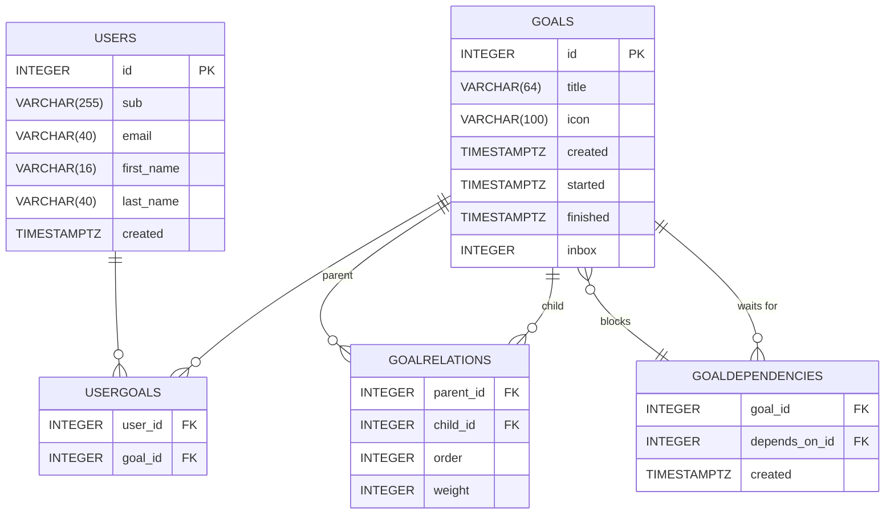
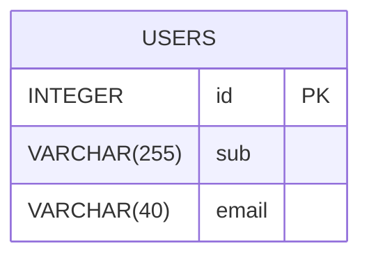

# Schema to Mermaid ER Diagram

Denna skill genererar ett Mermaid ER-diagram från en PostgreSQL schema.sql-fil
och uppdaterar README.md med diagrammet.

## Arbetsflöde

### Steg 1: Hitta schema.sql

Leta reda på schema.sql-filen i projektet. Vanliga platser:
- `environments/production/db/schema.sql`
- `db/schema.sql`
- `sql/schema.sql`
- `migrations/schema.sql`

Om det finns flera schema.sql-filer, fråga användaren vilken de vill använda.

### Steg 2: Läs och parsea schemat

Läs schema.sql och extrahera:
- Tabellnamn
- Kolumner med datatyper och constraints
- Primary keys
- Foreign keys
- UNIQUE constraints
- NOT NULL constraints

### Steg 3: Generera Mermaid ER-diagram

Skapa ett Mermaid `erDiagram` enligt detta format:



### Datatyper i Mermaid

✅ **Mermaid stöder alla typer som ren text** - det är bara visuella etiketter, inte validerade typer!

Vanliga typer som fungerar:
- `INTEGER`, `BIGINT`, `SMALLINT`
- `VARCHAR(n)`, `TEXT`, `CHAR`
- `NUMERIC(p,s)`, `DECIMAL`, `REAL`, `DOUBLE PRECISION`
- `BOOLEAN`
- `TIMESTAMP`, `TIMESTAMPTZ`, `DATE`, `TIME`
- `UUID`, `JSON`, `JSONB`
- `BYTEA`, `SERIAL`, `BIGSERIAL`

Constraints som stöds: `PK`, `FK`, `UK` (UNIQUE)

| SQL Construct | Mermaid Notation |
|---------------|-----------------|
| `PRIMARY KEY` | `PK` |
| `FOREIGN KEY` | `FK` |
| `NOT NULL` | `NN` |
| `UNIQUE` | `UK` |
| `INTEGER`, `BIGINT`, `SMALLINT`, `SERIAL` | `int` |
| `VARCHAR(n)`, `TEXT`, `CHAR`, `BPCHAR` | `string` |
| `DECIMAL`, `NUMERIC`, `REAL`, `DOUBLE` | `float` |
| `BOOLEAN` | `boolean` |
| `DATE` | `date` |
| `TIMESTAMP`, `TIMESTAMPTZ`, `TIME`, `TIMETZ` | `timestamp` |
| `GENERATED BY DEFAULT AS IDENTITY` | (implicit, ignorera) |
| `DEFAULT value` | (ignorera i diagram) |

### Steg 4: Uppdatera README.md

1. Läs befintlig README.md
2. Leta efter `## Database Schema` sektionen
3. Om sektionen finns, ersätt dess innehåll med det nya diagrammet
4. Om sektionen inte finns, lägg till den efter `## Tech Stack`
5. Använd formatet:

```markdown
## Database Schema

```mermaid
erDiagram
    [diagram content here]
```
```

## Exempel

**Input (schema.sql fragment):**
```sql
CREATE TABLE "users" (
  "id" INTEGER NOT NULL UNIQUE GENERATED BY DEFAULT AS IDENTITY,
  "sub" VARCHAR(255) NOT NULL UNIQUE,
  "email" VARCHAR(40) NOT NULL UNIQUE,
  PRIMARY KEY("id")
);
```

**Output (Mermaid):**


## Vanliga fallgropar

### ⚠️ VIKTIGT: Syntaxregler

1. **INGA tomma rader** inuti tabell-blocket! Mermaid parsrar fel om det finns
   tomma rader mellan kolumndefinitioner.

2. **Använd `int`** istället för `integer` - det är kortare och mindre risk för
   parsningsfel.

3. **Kompakt format** - håll allt på få rader för bättre kompatibilitet.

### Relationer mellan tabeller

- **Flera foreign keys till samma tabell**: Använd olika relationsetiketter
  för att skilja dem åt (t.ex. "parent" vs "child")

- **Sammansatta primary keys**: Listas som `type col1, col2 PK`

- **Join tables**: Visa som tabeller med två FK, relationerna visas som
  `||--o{` (one-to-many via join table)

- **Cirkulära referenser**: Använd notation som `}o--||` för att visa
  riktning korrekt:
  - `tableA }o--|| tableB : "waits for"` = A väntar på B
  - `tableB }o--|| tableA : "blocks"` = B blockerar A
